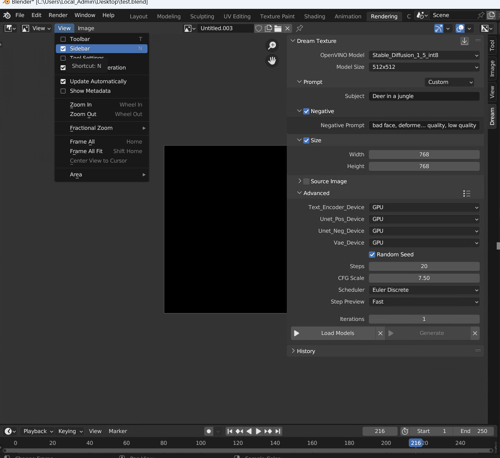

# Image Generation
1. To open Dream Textures, go to an Image Editor or Shader Editor
2. Ensure the sidebar is visible by pressing *N* or checking *View* > *Sidebar*
3. Select the *Dream* panel to open the interface

4. Select Stable_Diffusion_1_5 from OpenVino Model and device you want the model to run on.
5. Click on *Load Models* to load and compile the model on the device. This is a one-time step but if you need to chose a different model or the device please click *Load Models* again.
6. Enter a prompt and/or negative prompt and other parameters
7. Click on *Generate*. Wait for total inference steps to get completed.

### Prompt

A few presets are available to help you create great prompts. They work by asking you to fill in a few simple fields, then generate a full prompt string that is passed to Stable Diffusion.

The default preset is *Texture*. It asks for a subject, and adds the word `texture` to the end. So if you enter `brick wall`, it will use the prompt `brick wall texture`.

### Negative
Enabling negative prompts gives you finer control over your image. For example, if you asked for a `cloud city`, but you wanted to remove the buildings it added, you could enter the negative prompt `building`. This would tell Stable Diffusion to avoid drawing buildings. You can add as much content you want to the negative prompt, and it will avoid everything entered.

### Size

> Stable Diffusion-1.5 was trained on 512x512 images

### Source Image
Choose an image from a specific *File* or use the *Open Image*.

Three actions are available that work on a source image.

#### Modify
Mixes the image with the noise with the ratio specified by the *Noise Strength*. This will make Stable Diffusion match the style, composition, etc. from it.

Strength specifies how much latent noise to mix with the image. A higher strength means more latent noise, and more deviation from the init image. If you want it to stick to the image more, decrease the strength.

> Depending on the strength value, some steps will be skipped. For example, if you specified `10` steps and set strength to `0.5`, only `5` steps would be used.

Fit to width/height will ensure the image is contained within the configured size.

The *Image Type* option has a few options:
1. Color - Mixes the image with noise -- Not yet enabled

> The following options require a depth model to be selected, `Stable_Diffusion_1_5_controlnet_depth`. 

2. Color and Generated Depth - Uses MiDaS to infer the depth of the initial image and includes it in the conditioning. Can give results that more closely match the composition of the source image.
3. Color and Depth Map - Specify a secondary image to use as the depth map, instead of generating one with MiDaS.
4. Depth - Treats the intial image as a depth map, and ignores any color. The generated image will match the composition but not colors of the original.

### Advanced
You can have more control over the generation by trying different values for these parameters:

* Random Seed - When enabled, a seed will be selected for you
    * Seed - The value used to seed RNG, if text is input instead of a number its hash will be used
* Steps - Number of sampler steps, higher steps will give the sampler more time to converge and clear up artifacts
* CFG Scale - How strongly the prompt influences the output
* Scheduler - Some schedulers take fewer steps to produce a good result than others. Try each one and see what you prefer.
* Step Preview - Whether to show each step in the image editor. Defaults to 'Fast', which samples the latents without using the VAE. 

### Iterations - Use 1 for now
How many images to generate. This is only particularly useful when *Random Seed* is enabled.